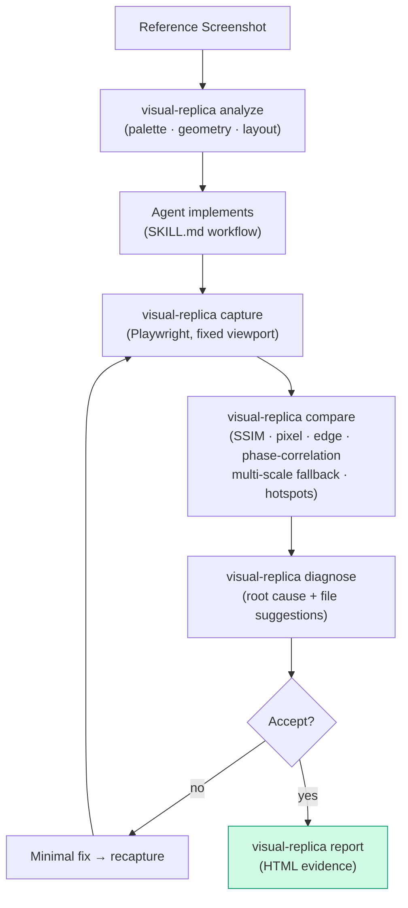

<div align="center">

# 🧬 Visual Replica Skill Pro

**A disciplined Agent Skill + deterministic visual QA toolkit for high-fidelity screenshot-driven UI reconstruction.**

Make AI behave like a **senior visual frontend engineer** — reproduce the target, not an interpretation of it.


*For Cursor · Claude Code · Codex · and any coding agent that can run Python.*

</div>

---

## 🎯 What it is

Not another autonomous UI agent. The **coding agent edits code**; Visual Replica supplies a **disciplined workflow and visual evidence**:

- `SKILL.md` — expert workflow and guardrails for coding agents
- `visual_replica/` — deterministic Python toolkit: analysis, comparison, diagnosis, reporting, benchmarking
- `scripts/capture.mjs` — deterministic web capture via Playwright
- `tests/` — synthetic tests that verify real measurements, not placeholders

> **Fundamental principle:** Reference image = visual specification. Rendered application = only reliable evidence. Never claim success from code inspection alone.

## 🔁 The Loop



## 🧰 Toolkit

Unified CLI: `visual-replica <command>`

| Command | What it does |
| :--- | :--- |
| `doctor` | Environment self-check (deps, optional adapters) |
| `analyze` | Reference analysis → palette, edges, layout evidence |
| `compare` | Multi-metric diff: SSIM, pixel, edge, phase-correlation, multi-scale fallback, hotspot clustering, regional scoring |
| `diagnose` | Root-cause classification **with repository file suggestions** |
| `report` | Self-contained HTML report of comparison + diagnosis |
| `capture` | Deterministic Playwright screenshot at fixed viewport |
| `benchmark` | Manifest-driven benchmark runs |

### Metrics depth

- **Core** (Pillow / NumPy / scikit-image / OpenCV): pixel, edge, SSIM, pyramid multi-scale SSIM, layout proposals, hotspots
- **`[deep]` extra**: native MS-SSIM + LPIPS (PyTorch — LPIPS is a distance, *lower* = more similar, input normalized to `[-1, 1]`)
- **`[ocr]` extra**: pytesseract adapter (or PaddleOCR via `--ocr paddle`) for text-region fidelity

## 🚀 Quick start

```bash
python -m venv .venv && source .venv/bin/activate   # Windows: .venv\Scripts\activate
pip install -e .                                    # optional: pip install -e '.[deep]' '.[ocr]'

visual-replica doctor
visual-replica analyze reference.png --out .visual-replica/reference-analysis.json
visual-replica compare reference.png candidate.png --out-dir .visual-replica/compare
visual-replica diagnose .visual-replica/compare/comparison.json --repo . --out .visual-replica/diagnosis.json
visual-replica report --comparison .visual-replica/compare/comparison.json \
  --diagnosis .visual-replica/diagnosis.json --out-dir .visual-replica/report
```

Browser capture:

```bash
npm install
npx playwright install chromium
visual-replica capture http://localhost:3000 --width 390 --height 844 --out candidate.png
```

## 📦 Structure

```text
visual-replica-skill-pro/
├── SKILL.md                    # expert workflow + guardrails
├── visual_replica/             # Python toolkit (11 modules)
│   ├── cli.py                  #   unified CLI entry
│   ├── analyze.py / compare.py / metrics.py / hotspots.py
│   ├── diagnose.py / report.py #   root cause + HTML evidence
│   └── benchmark.py / doctor.py / utils.py / assets/capture.mjs
├── scripts/capture.mjs         # Playwright capture
├── references/                 # diff-to-fix · fidelity-model · platform-guidelines
│                               #   self-improvement · toolkit-contract
├── templates/regions.json      # critical-region definitions
├── benchmarks/manifest.example.json
├── examples/synthetic/         # reference vs candidate demo
├── tests/                      # pytest suite (metrics, analyze, report, pipeline)
├── .github/workflows/ci.yml    # pytest + ruff on push/PR
├── pyproject.toml · package.json · VALIDATION.md · CONTRIBUTING.md
└── CHANGELOG.md
```

## 🔬 Validation

`VALIDATION.md` documents how the toolkit is verified. CI runs `pytest` and `ruff` on every push — the measurements are real, and regressions get caught.

## 📜 License

[MIT](LICENSE) © 2026 [C-surfing](https://github.com/C-surfing)

---

<p align="center">Evidence over vibes. Reproduce the reference, not an interpretation of it. 🎯</p>
