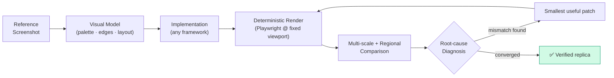
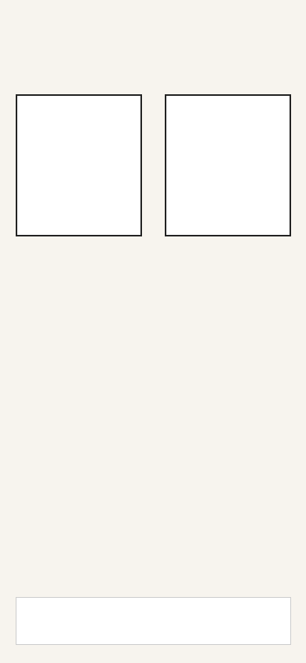
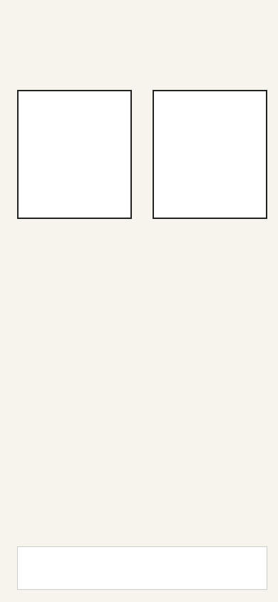
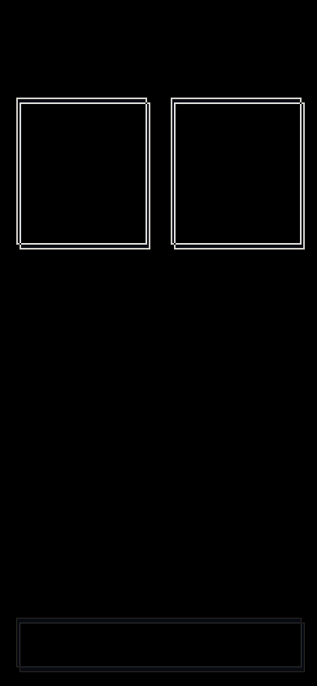
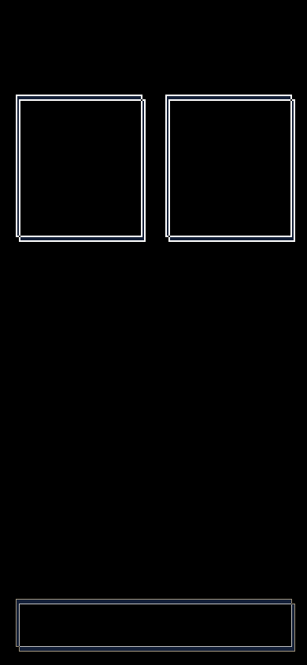
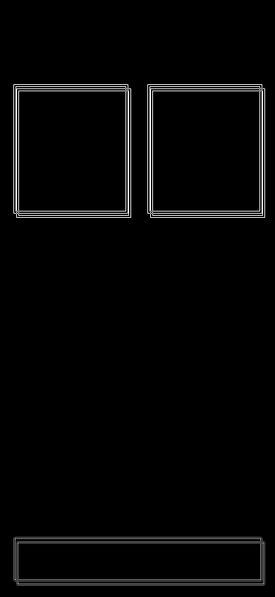
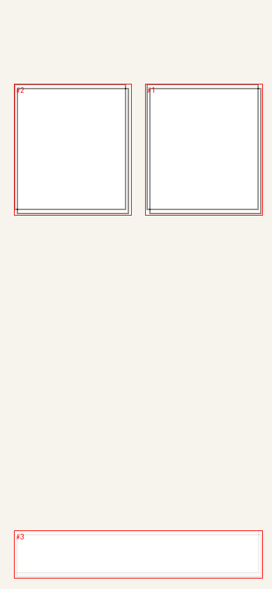

<div align="center">

# 🎯 Pixel Perfect UI

**High-fidelity screenshot-to-code replication — as a measured optimization loop.**

Reproduce the reference, not an interpretation of it.


*An installable Agent Skill for Claude Code, Codex, Cursor & any agent that can run Python scripts.*

</div>

---

## What it is

Most "copy this screenshot" prompts produce something that *looks* right — once. `pixel-perfect-ui` treats UI replication as **constrained optimization**: the reference screenshot is the visual source of truth, the running implementation is the thing being judged, and **source code alone is never evidence of visual fidelity**.

Every iteration is measured, localized, and repeatable:



## ✨ v2 highlights

- **Multi-scale comparison** — catches macro layout, component, *and* sub-pixel detail errors at 4× / 2× / 1× scales
- **Edge-weighted similarity** — blank-background regions can't inflate your score
- **Global translation estimation** — tells you the shell/viewport shifted *before* you debug child offsets
- **Automatic hotspot clustering** — annotated `hotspots.png` pinpoints exactly where the biggest mismatch lives
- **Critical-region scoring** — weight the parts that matter (`cards`, `bottom-nav`, …) via `regions.json`
- **Reference analyzer** — palette + edge/anchor evidence extracted *before* you write a line of code
- **Iteration ledger + rollback discipline** — never chase a regression blind
- **Anti-hack acceptance rules** — resizing screenshots post-capture to fake a score is rejected
- **Platform adapters** — web, WeChat Mini Program, Flutter, React Native, native

## 🔬 See it in action

Synthetic example shipped in this repo (390×844 mobile viewport) — reference vs. first-pass candidate:

| Reference | Candidate |
| :---: | :---: |
|  |  |

The comparison step doesn't just give a number — it *shows* the mismatch:

| Diff | Amplified diff | Edge diff | Hotspots |
| :---: | :---: | :---: | :---: |
|  |  |  |  |

Sample real output from `examples/verified-diff/metrics.json`:

| Metric | Value |
| :--- | :--- |
| Pixel similarity (global) | 0.984 |
| Edge-weighted similarity | 0.984 |
| SSIM | 0.915 |
| Composite progress signal | 0.969 |
| Detected hotspots | 3 (auto-clustered, impact-ranked) |
| Diagnostic hint | *"Meaningful global translation detected: inspect viewport/safe-area/shell/header before child offsets."* (dx=−4, dy=−6 px) |

> `image_composite` is a **progress signal, not proof of perceptual identity** — the skill's philosophy is: make fidelity measurable, localizable, repeatable, and hard to fake.

## 🚀 Quick start

### 1. Install the skill

Copy the folder into any supported skill location:

```text
.claude/skills/pixel-perfect-ui/
.codex/skills/pixel-perfect-ui/
.cursor/skills/pixel-perfect-ui/
.agents/skills/pixel-perfect-ui/
```

### 2. Install optional tooling

```bash
npm install
npx playwright install chromium
pip install -r requirements.txt        # Pillow, numpy
pip install scikit-image                # optional: SSIM
```

### 3. Run the loop

```bash
# Analyze the reference first (palette, edges, anchors)
python scripts/analyze_reference.py reference.png --out-dir .ui-replica/analysis

# Render the implementation deterministically
node scripts/capture.mjs --url http://localhost:3000/menu --width 390 --height 844 \
  --out .ui-replica/candidate/candidate.png

# Compare — globally, regionally, multi-scale, with hotspot maps
python scripts/compare.py reference.png .ui-replica/candidate/candidate.png \
  --out-dir .ui-replica/diff

# Critical regions get extra weight
python scripts/compare.py reference.png candidate.png \
  --regions-json examples/regions.json --out-dir .ui-replica/diff

# Or evaluate a whole target list in one shot
python scripts/evaluate_targets.py --config .ui-replica/replica-config.json
```

## 📦 Repository structure

```text
pixel-perfect-ui/
├── SKILL.md                    # The skill itself (agent-facing instructions)
├── agents/openai.yaml          # Agent descriptor
├── scripts/                    # Python + Node tooling
│   ├── analyze_reference.py    #   palette / edge / anchor evidence
│   ├── capture.mjs             #   Playwright deterministic render
│   ├── compare.py              #   multi-scale + regional + hotspot diff
│   ├── evaluate_targets.py     #   multi-target aggregator
│   ├── init_workspace.py       #   .ui-replica workspace scaffold
│   └── ledger.py               #   iteration ledger helper
├── references/                 # 10 playbooks: diagnostics, anti-patterns,
│                               #   fidelity model, platform adapters, …
├── templates/                  # spec / config / ledger / stabilize.css
├── examples/                   # synthetic reference + verified diff artifacts
└── CHANGELOG.md
```

## 🧭 Supported targets

| Platform | Notes |
| :--- | :--- |
| Web | Playwright capture, CSS pixel-perfect |
| WeChat Mini Program | WXML/WXSS mapping, safe-area aware |
| Flutter | Render to PNG at fixed logical size |
| React Native | Device-pixel-ratio handling |
| Native (iOS/Android) | Simulator/emulator capture, screen-density adapters |

## 📜 License

[MIT](LICENSE) © 2026 [C-surfing](https://github.com/C-surfing)

---

<p align="center">Made with a measured loop, not a screenshot of hope. 🎯</p>
