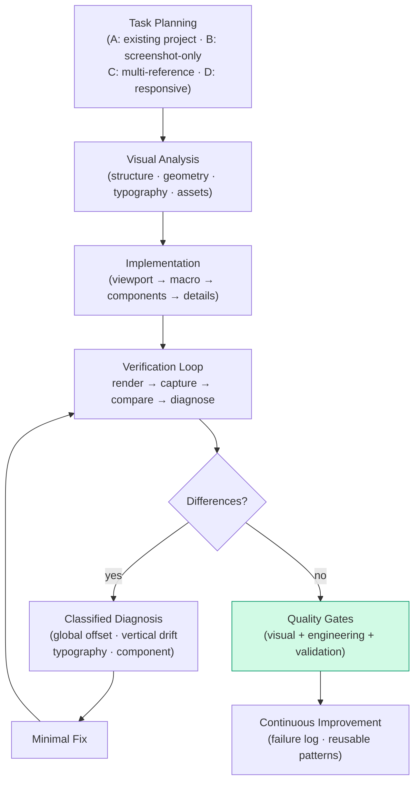

<div align="center">

# 🧬 Visual Replica Skill Pro

**Make AI behave like a senior visual frontend engineer.**

[]
[]
[]
[]

*An expert-level UI replication skill — screenshot-first reconstruction with visual QA, regression thinking, diff diagnosis, and continuous improvement.*

</div>

---

## 🎯 Goal

Make AI behave like a **senior visual frontend engineer** — not someone who makes a *beautiful new design*, but someone who **reproduces the existing visual target faithfully while keeping production-quality code**.

## 🧭 Design Principles

> **Reference image = visual specification.**
>
> **Rendered application = only reliable evidence.**
>
> **Never claim success from code inspection alone.**

## 🔁 The Workflow



## ✨ What makes it *Pro*

| Capability | How |
| :--- | :--- |
| **Task-aware planning** | Classifies 4 task types (existing project / screenshot-only / multi-reference / responsive) before touching code |
| **Classified diagnosis** | Global offset → vertical drift → typography mismatch → component mismatch, each with its own check-list |
| **Implementation ordering** | Viewport first, micro-details last — never tune shadows while layout is wrong |
| **Iteration learning** | Every iteration records Problem → Hypothesis → Change → Result; only keep improvements, rollback regressions |
| **Quality gates** | Visual + engineering + validation — no screenshot hacks, no excessive absolute positioning |
| **Continuous improvement** | Failure patterns and successful fixes feed future tasks |

## 📦 Structure

```text
visual-replica-skill-pro/
├── SKILL.md                        # The skill itself
├── references/
│   ├── task-planning.md            #   task type classification
│   ├── diff-to-fix.md              #   diagnosis → fix mapping
│   ├── quality-gates.md            #   acceptance criteria
│   ├── platform-guidelines.md      #   platform-specific rules
│   └── anti-patterns.md            #   what NOT to do
├── templates/
│   ├── visual-spec.json            #   visual specification output
│   └── iteration-log.json          #   iteration learning record
├── learning/
│   └── failure-log.template.md     #   failure pattern ledger
├── scripts/README.md               #   tooling notes
└── README.md
```

## 🚀 Install

Copy the folder into any supported skill location:

```text
.cursor/skills/visual-replica-skill-pro/
.claude/skills/visual-replica-skill-pro/
.codex/skills/visual-replica-skill-pro/
.agents/skills/visual-replica-skill-pro/
```

## 📜 License

[MIT](LICENSE) © 2026 [C-surfing](https://github.com/C-surfing)

---

<p align="center">Reproduce the reference, not an interpretation of it. 🎯</p>
